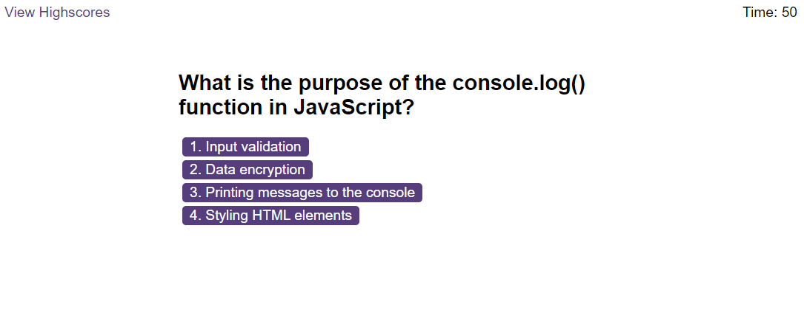
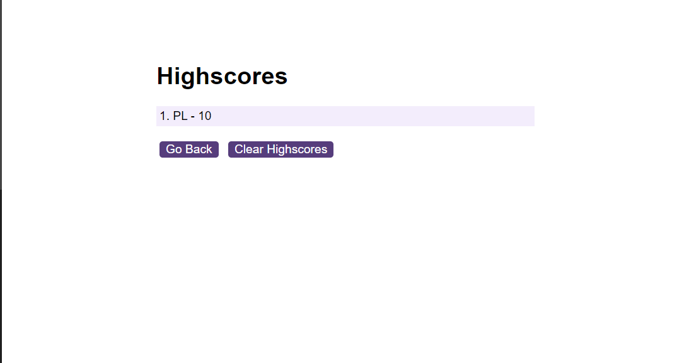
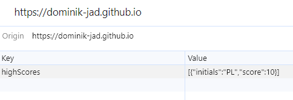

# Code Quiz


<details>
  <summary>Table of Contents</summary>
  <ol>
    <li><a href="#Description">Description</a></li>
    <li><a href="#Screenshot">Screenshot</a></li>
    <li><a href="#Installation">Installation</a></li>
    <li><a href="#Usage">Usage</a></li>
    <li><a href="#Link">Link</a></li>
    <li><a href="#Credits">Credits</a></li>
    <li><a href="#License">License</a></li>
  </ol>
</details>


## Description
This simple JavaScript quiz was made to help users test their knowelegde of simple JavaScript terms. User highscores are saved locally and displayed so the user is able to see their progress over time. Questions are easily added to the quiz so when the user wants to expand the quiz they can do so by adding more questions to the questions object.


## Screenshot







## Installation


To install this project clone the repo
    ```
    git@github.com:Dominik-Jad/code-quiz.git
    ```


Open the files in VS Code and select 'Open With Live Server' on index.html. Click on the 'start quiz' button and go through the quiz. Your high score will be saved locally and displayed when you click 'view highscores' button


## Usage


This simple quiz app allows the user to test their knoweledge of Java Script. The user is able to see what they know and what they need to spend more time learning. Becasuse the questions are stored in an object it is easy for the user to add more questions in the future. This will help them to stay on top of their learning. 


## Link


https://dominik-jad.github.io/code-quiz/


## Credits


setInterval() - https://developer.mozilla.org/en-US/docs/Web/API/setInterval

setAttribute() - https://developer.mozilla.org/en-US/docs/Web/API/Element/setAttribute


JSON.stringify() - https://developer.mozilla.org/en-US/docs/Web/JavaScript/Reference/Global_Objects/JSON/stringify

JSON.parse() - https://developer.mozilla.org/en-US/docs/Web/JavaScript/Reference/Global_Objects/JSON/parse

## Licence


Please refer to the LICENCE in the repo.


